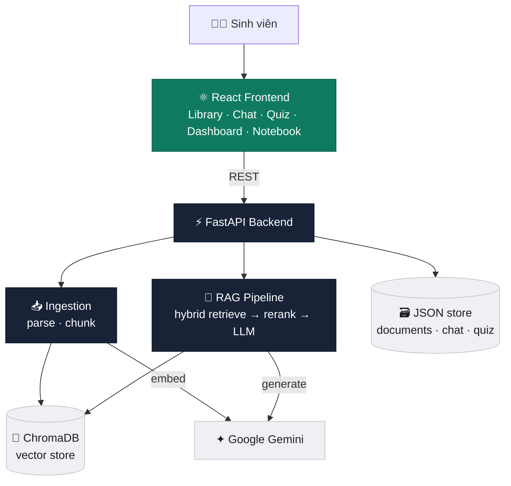

<div align="center">


<br/>


<br/>

[](LICENSE)
[](#-điểm-nổi-bật-kỹ-thuật)
[](https://ai.google.dev)
[](https://github.com/sai-ctruong/AI-campus-assistant/pulls)

<a href="#"></a>

**Biến slide, giáo trình PDF, Word và notebook thành một trợ lý học tập biết trả lời — luôn kèm trích dẫn tới từng trang.**

</div>

<div align="center">

[Tính năng](#-tính-năng) • [Demo](#-demo) • [Kiến trúc](#️-kiến-trúc) • [Tech stack](#️-tech-stack) • [Cấu trúc](#-cấu-trúc-project) • [Cài đặt](#-cài-đặt) • [API](#-api) • [Điểm nổi bật](#-điểm-nổi-bật-kỹ-thuật)

</div>

---

## 📖 Giới thiệu

**AI Campus Assistant** là trợ lý học tập dựa trên **RAG (Retrieval-Augmented Generation)**. Tải tài liệu lên, hỏi bất cứ điều gì và nhận câu trả lời **bám sát nội dung của bạn, luôn kèm trích dẫn nguồn** — thay vì để mô hình "bịa".

Điểm khác biệt so với một chatbot thường: pipeline RAG chỉn chu với **hybrid retrieval** (vector + BM25) + **cross-encoder reranking**, chống hallucination bằng structured output, gói trong một giao diện học thuật sạch sẽ.

---

## ✨ Tính năng

| | Tính năng | Mô tả |
|:--:|---|---|
| 💬 | **Chat kèm trích dẫn** | Trả lời gắn `[1] [2]` bấm được → mở panel xem đúng đoạn nguồn + trang/phần/cell |
| 🔍 | **Hybrid retrieval + rerank** | Vector (ngữ nghĩa) + BM25 (từ khóa) gộp bằng RRF, rồi cross-encoder chấm lại |
| 🚫 | **Chống bịa** | Chỉ trả lời từ tài liệu; thiếu dữ kiện thì nói thẳng "không tìm thấy" |
| 📝 | **Quiz & flashcard** | Tự sinh trắc nghiệm (kèm giải thích + nguồn) và flashcard từ tài liệu |
| 📊 | **Theo dõi tiến độ** | Dashboard thống kê độ chính xác quiz, chỉ ra vùng kiến thức yếu nhất |
| 🧑‍💻 | **Giải thích notebook** | Đọc `.ipynb`, chú giải từng code cell theo ngữ cảnh cả bài |
| 🎙️ | **Voice mode tiếng Việt** | Nói câu hỏi và nghe đọc câu trả lời (Web Speech API) |
| 📄 | **Đa định dạng** | PDF · Word (.docx) · Jupyter notebook |

---

## 🎬 Demo

> Thêm ảnh chụp vào `docs/screenshots/` (xem hướng dẫn trong thư mục) để phần này hiển thị.

<div align="center">

| 📚 Library | 💬 Chat + trích dẫn |
|:--:|:--:|
|  |  |
| 📝 **Quiz** | 📊 **Dashboard** |
|  |  |

🧑‍💻 **Notebook explainer**


</div>

---

## 🏗️ Kiến trúc



<div align="center">

**Ingest:** `tài liệu → parse → chunk → embed → ChromaDB`  
**Chat:** `câu hỏi → embed → hybrid retrieve → rerank → prompt kèm citation → LLM → câu trả lời có nguồn`

</div>

---

## 🛠️ Tech Stack

<div align="center">

</div>

| Layer | Công nghệ |
|---|---|
| **Backend** | FastAPI · Uvicorn · Pydantic |
| **AI / RAG** | Google Gemini (embedding `gemini-embedding-001` + LLM `gemini-2.5-flash`) · ChromaDB · rank-bm25 · cross-encoder |
| **Ingestion** | pypdf · python-docx · nbformat |
| **Frontend** | React 19 · TypeScript · Vite · Tailwind CSS v4 · Motion |

---

## 📂 Cấu trúc project

```
AI-campus-assistant/
├── backend/
│   ├── app/
│   │   ├── main.py                  # FastAPI app + CORS + đăng ký router
│   │   ├── config.py                # Settings đọc từ .env
│   │   ├── schemas.py               # Pydantic models cho API
│   │   ├── ingestion/
│   │   │   ├── pdf_parser.py         # trích text PDF theo trang
│   │   │   ├── docx_parser.py        # trích text Word (đoạn + bảng)
│   │   │   ├── notebook_parser.py    # tách cell .ipynb
│   │   │   ├── chunker.py            # chia chunk + metadata (citation)
│   │   │   └── pipeline.py           # parse → chunk → embed → store
│   │   ├── embedding/
│   │   │   └── embedder.py           # Gemini embedding (retry rate-limit)
│   │   ├── db/
│   │   │   ├── chroma_client.py      # vector store (ChromaDB)
│   │   │   ├── document_store.py     # registry tài liệu (JSON)
│   │   │   ├── chat_store.py         # lịch sử chat (JSON)
│   │   │   └── quiz_store.py         # kết quả quiz (JSON)
│   │   ├── rag/
│   │   │   ├── retriever.py          # hybrid vector + BM25 + RRF
│   │   │   ├── reranker.py           # cross-encoder rerank
│   │   │   ├── generator.py          # LLM answer + citation
│   │   │   ├── quiz_generator.py     # sinh quiz + flashcard
│   │   │   └── notebook_explainer.py # giải thích code cell
│   │   └── routers/
│   │       ├── documents.py          # upload · list · delete
│   │       ├── chat.py               # chat · history
│   │       ├── quiz.py               # generate · attempts · progress
│   │       └── explain.py            # giải thích notebook
│   ├── Dockerfile
│   └── requirements.txt
└── frontend/
    └── src/
        ├── pages/                   # Library · Chat · Quiz · Dashboard · Notebook
        ├── components/              # AIResponseCard · CitationChip · SourcePanel · NavRail · Icon
        │   └── layout/              # AppSidebar · TopBar · Shell
        ├── hooks/useSpeech.ts       # voice (Web Speech API)
        ├── api.ts · types.ts        # client + kiểu dữ liệu
        └── index.css                # design tokens (Tailwind v4)
```

---

## 🚀 Cài đặt

> **Yêu cầu:** Python 3.9+ · Node 18+ · [Gemini API key](https://aistudio.google.com/apikey) (miễn phí)

<details open>
<summary><b>⚡ Backend</b></summary>

```bash
cd backend
python -m venv venv
.\venv\Scripts\activate          # Windows  ·  source venv/bin/activate (macOS/Linux)
pip install -r requirements.txt

echo "GEMINI_API_KEY=your_key_here" > .env
uvicorn app.main:app --reload
```

→ API tại **http://localhost:8000** · docs tự sinh tại **/docs**

</details>

<details open>
<summary><b>⚛️ Frontend</b></summary>

```bash
cd frontend
npm install
npm run dev
```

→ Web tại **http://localhost:5173**

</details>

---

## 🔌 API

| Method | Endpoint | Mô tả |
|:--|:--|:--|
| `POST` | `/documents/upload` | Upload tài liệu (async ingest) |
| `GET` | `/documents` | Danh sách tài liệu |
| `DELETE` | `/documents/{id}` | Xóa tài liệu + vector |
| `POST` | `/chat/{id}` | Hỏi → câu trả lời + trích dẫn |
| `GET` | `/chat/{id}/history` | Lịch sử chat |
| `POST` | `/quiz/{id}/generate` | Sinh quiz + flashcard |
| `POST` | `/quiz/attempts` | Ghi kết quả làm quiz |
| `GET` | `/progress` | Dữ liệu dashboard tiến độ |
| `POST` | `/explain/{id}` | Giải thích notebook |

---

## 💡 Điểm nổi bật kỹ thuật

- **Hybrid retrieval** — kết hợp vector search (ngữ nghĩa) + BM25 (từ khóa), gộp bằng *Reciprocal Rank Fusion* thay vì chỉ dùng vector → bắt được cả câu hỏi dùng thuật ngữ chính xác lẫn diễn đạt tự nhiên.
- **Cross-encoder reranking** — chấm lại top-20 ứng viên, giữ top-5 liên quan nhất trước khi đưa vào LLM.
- **Chống hallucination** — structured JSON output + cờ `found_answer`; trích dẫn được **map từ chỉ số đoạn LLM thực sự dùng**, không tin số trang do LLM tự ghi.
- **Conversation memory** — nhớ vài lượt gần nhất để hiểu câu hỏi follow-up ("còn phần kia thì sao?").
- **Ingest bất đồng bộ** — upload không block server (FastAPI `BackgroundTasks`), tự cập nhật trạng thái `processing → ready/failed`.
- **Đa định dạng** — parser riêng cho PDF / Word / notebook, mỗi chunk mang metadata riêng phục vụ trích dẫn tới đúng trang / phần / cell.

---

## 👤 Tác giả

**Phạm Công Trường** — [GitHub @sai-ctruong](https://github.com/sai-ctruong)

---

## 📄 License

Phát hành theo giấy phép **MIT** — xem [LICENSE](LICENSE).

<div align="center">


Made with 💚 for students who want to study smarter.

</div>
