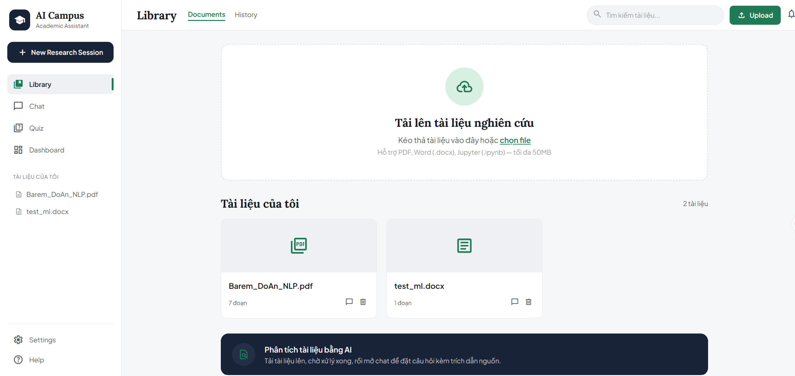
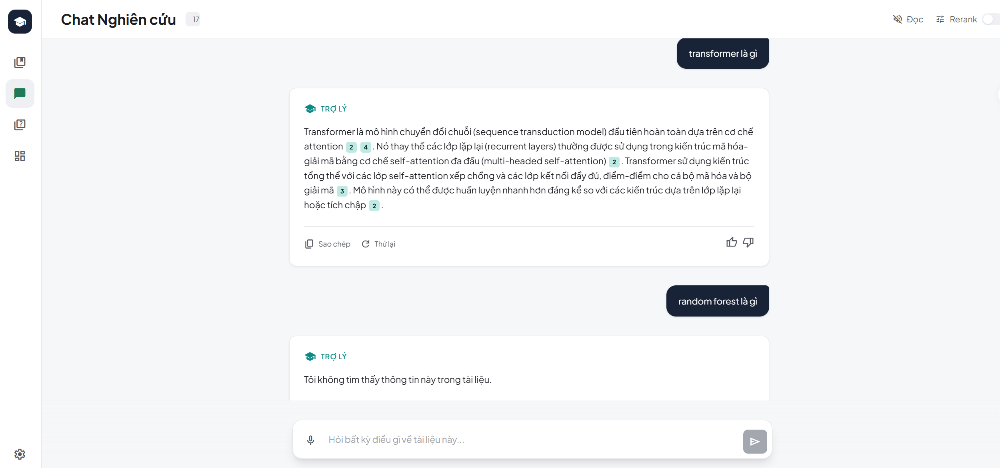
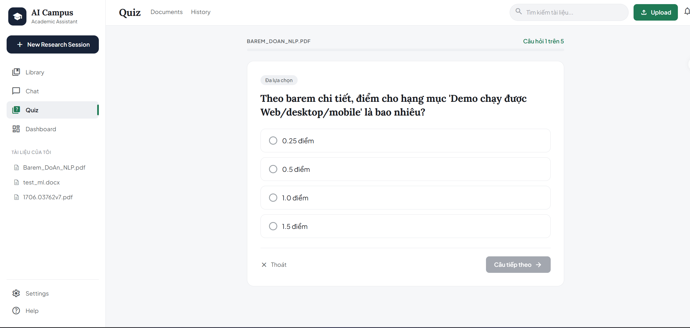
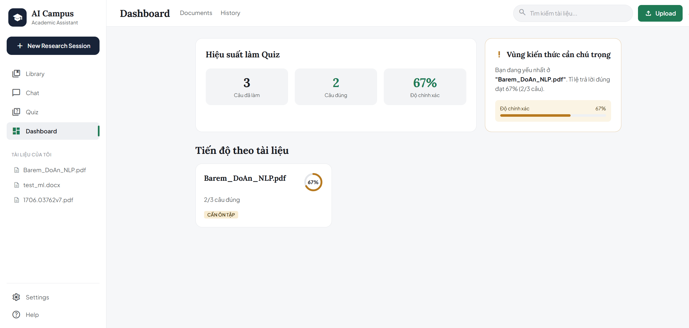
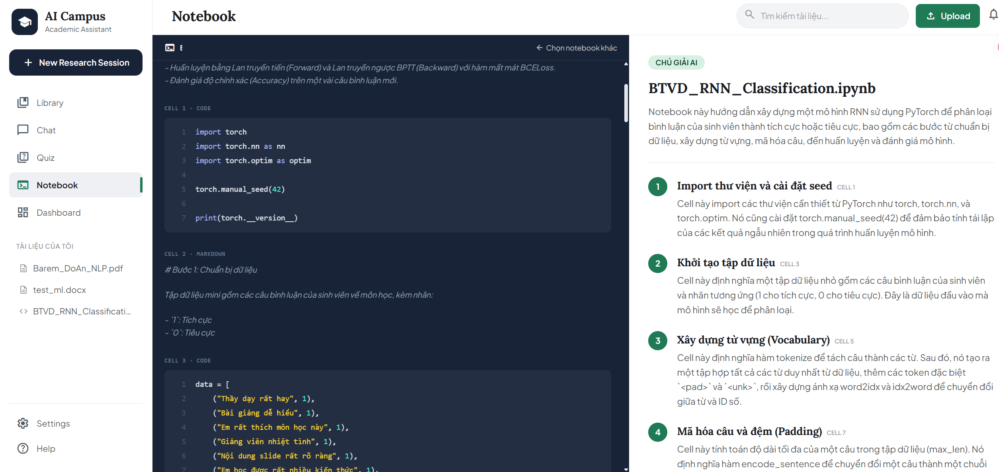
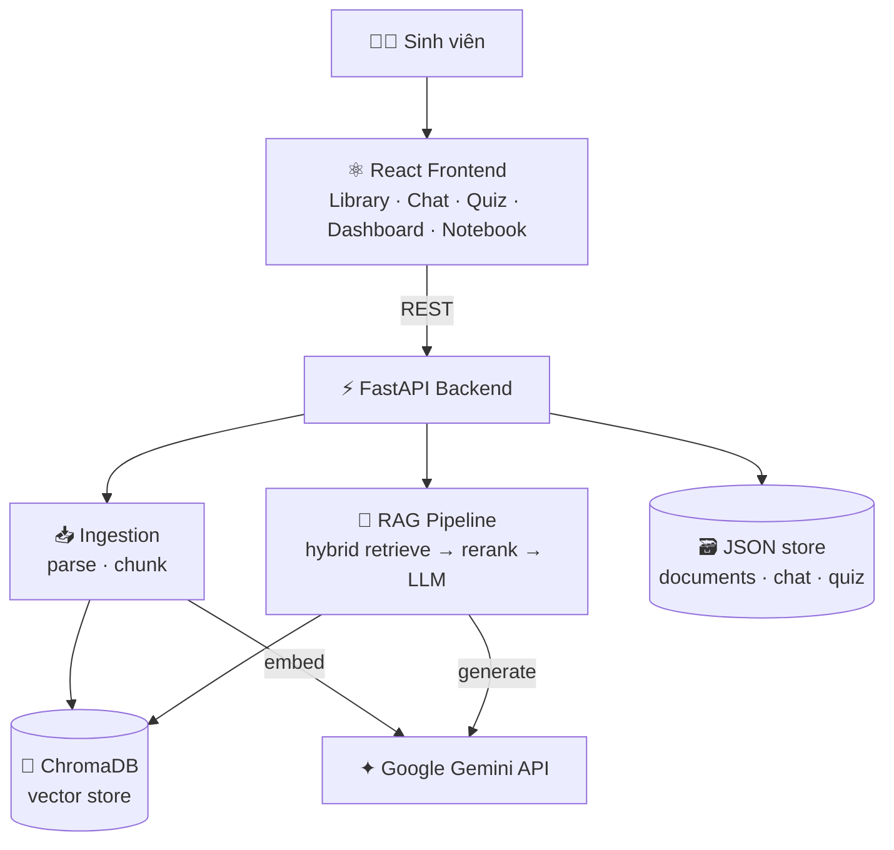

<div align="center">


<br/><br/>

[](https://python.org)
[](https://fastapi.tiangolo.com)
[](https://react.dev)
[](https://typescriptlang.org)
[](https://tailwindcss.com)
[](https://ai.google.dev)
[](https://trychroma.com)
[](LICENSE)

**Biến slide, giáo trình PDF, Word và notebook thành một trợ lý học tập biết trả lời kèm trích dẫn tới từng trang.**

[Tính năng](#-tính-năng) · [Demo](#-demo) · [Kiến trúc](#️-kiến-trúc) · [Cài đặt](#-cài-đặt) · [API](#-api) · [Deploy](DEPLOYMENT.md)

</div>

---

## 📖 Giới thiệu

**AI Campus Assistant** là một trợ lý học tập dựa trên **RAG (Retrieval-Augmented Generation)**. Tải tài liệu lên, hỏi bất cứ điều gì và nhận câu trả lời **bám sát nội dung của bạn, luôn kèm trích dẫn nguồn** — thay vì để mô hình "bịa".

Được xây dựng với pipeline RAG chỉn chu: **hybrid retrieval** (vector + BM25) + **cross-encoder reranking**, chống hallucination bằng structured output, và một giao diện học thuật sạch sẽ.

---

## ✨ Tính năng

| | Tính năng | Mô tả |
|:--:|---|---|
| 💬 | **Chat kèm trích dẫn** | Trả lời có gắn `[1] [2]` bấm được → mở panel xem đúng đoạn nguồn + số trang/phần/cell |
| 🔍 | **Hybrid retrieval + rerank** | Vector (ngữ nghĩa) + BM25 (từ khóa) gộp bằng RRF, rồi cross-encoder chấm lại |
| 🚫 | **Chống bịa** | Chỉ trả lời từ tài liệu; không đủ dữ kiện thì nói thẳng "không tìm thấy" |
| 📝 | **Quiz & flashcard** | Tự sinh câu trắc nghiệm (kèm giải thích + nguồn) và flashcard từ tài liệu |
| 📊 | **Theo dõi tiến độ** | Dashboard thống kê độ chính xác quiz, chỉ ra vùng kiến thức yếu nhất |
| 🧑‍💻 | **Giải thích notebook** | Đọc `.ipynb`, chú giải từng code cell theo ngữ cảnh cả bài |
| 🎙️ | **Voice mode tiếng Việt** | Nói câu hỏi và nghe đọc câu trả lời (Web Speech API) |
| 📄 | **Đa định dạng** | PDF · Word (.docx) · Jupyter notebook |

---

## 🎬 Demo

> Thêm ảnh chụp vào `docs/screenshots/` (xem hướng dẫn trong thư mục đó) để phần này hiển thị.

<div align="center">

| Library | Chat + trích dẫn |
|:--:|:--:|
|  |  |
| **Quiz** | **Dashboard** |
|  |  |



</div>

---

## 🏗️ Kiến trúc



**Luồng RAG:** `tài liệu → parse → chunk → embed → ChromaDB` khi nạp, và `câu hỏi → embed → hybrid retrieve → rerank → prompt kèm citation → LLM → câu trả lời có nguồn` khi chat.

---

## 🛠️ Tech Stack

<div align="center">

| Backend | Frontend | AI / Data |
|---|---|---|
| FastAPI · Uvicorn | React 19 · TypeScript | Google Gemini (embedding + LLM) |
| Pydantic | Vite · Tailwind CSS v4 | ChromaDB (vector store) |
| pypdf · python-docx · nbformat | Motion (animation) | rank-bm25 · cross-encoder |

</div>

---

## 📂 Cấu trúc

```
AI-campus-assistant/
├── backend/
│   └── app/
│       ├── ingestion/   # parse PDF/Word/notebook + chunk
│       ├── embedding/   # Gemini embedder
│       ├── db/          # ChromaDB client + JSON stores
│       ├── rag/         # retriever · reranker · generator · quiz · explainer
│       └── routers/     # documents · chat · quiz · explain
├── frontend/
│   └── src/
│       ├── pages/       # Library · Chat · Quiz · Dashboard · Notebook
│       ├── components/  # UI + layout
│       └── hooks/       # useSpeech (voice)
└── DEPLOYMENT.md        # hướng dẫn deploy Render + Vercel
```

---

## 🚀 Cài đặt

**Yêu cầu:** Python 3.9+ · Node 18+ · [Gemini API key](https://aistudio.google.com/apikey) (miễn phí)

### Backend

```bash
cd backend
python -m venv venv
.\venv\Scripts\activate        # Windows  ·  source venv/bin/activate (macOS/Linux)
pip install -r requirements.txt

echo "GEMINI_API_KEY=your_key_here" > .env
uvicorn app.main:app --reload
```

→ API tại **http://localhost:8000** · docs tự sinh tại **/docs**

### Frontend

```bash
cd frontend
npm install
npm run dev
```

→ Web tại **http://localhost:5173**

---

## 🔌 API

| Method | Endpoint | Mô tả |
|---|---|---|
| `POST` | `/documents/upload` | Upload tài liệu (async ingest) |
| `GET` | `/documents` | Danh sách tài liệu |
| `DELETE` | `/documents/{id}` | Xóa tài liệu + vector |
| `POST` | `/chat/{id}` | Hỏi → câu trả lời + trích dẫn |
| `GET` | `/chat/{id}/history` | Lịch sử chat |
| `POST` | `/quiz/{id}/generate` | Sinh quiz + flashcard |
| `POST` | `/quiz/attempts` | Ghi kết quả làm quiz |
| `GET` | `/progress` | Dữ liệu dashboard tiến độ |
| `POST` | `/explain/{id}` | Giải thích notebook |

---

## 🗺️ Roadmap

- [x] **P0–1** Kiến trúc & scaffolding full-stack
- [x] **P2** Ingestion (PDF · Word · notebook)
- [x] **P3** Embedding + ChromaDB
- [x] **P4** Hybrid retrieval + rerank
- [x] **P5** LLM + citation + chống hallucination
- [x] **P6** Backend API
- [x] **P7** Frontend (5 màn hình)
- [x] **P8** Quiz & flashcard
- [x] **P9** Notebook explainer
- [x] **P10** Progress tracking
- [x] **P11** Voice mode tiếng Việt
- [x] **P12** Deployment-ready

---

## 📄 License

Phát hành theo giấy phép **MIT** — xem [LICENSE](LICENSE).

<div align="center">


Made with 💚 for students who want to study smarter.

</div>
